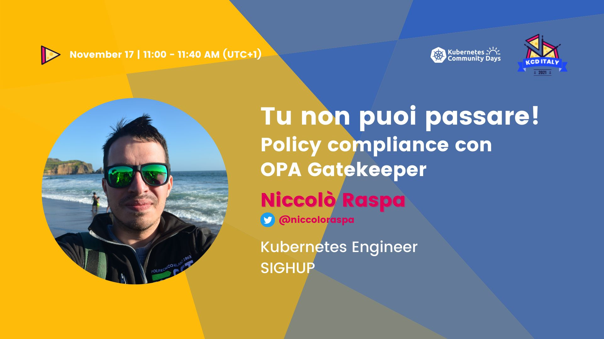

# KCD Italy 2021 Demo 🍕 ☸️🇮🇹

Repository for the talk *"Tu non puoi passare! Policy compliance con OPA Gatekeeper"* presented at **KCD Italy 2021** 🇮🇹.

> Slides are available under [./slides/](./slides/)

## ☸️ Setup Minikube Cluster

1. Create minikube cluster

```bash
make minikube
```

## 🔨 Deploy OPA Gatekeeper and Gatekeeper Policy Manager

1. Deploy OPA Gatekeeper 3.5:

```bash
kubectl apply -f https://raw.githubusercontent.com/open-policy-agent/gatekeeper/release-3.5/deploy/gatekeeper.yaml
# Local version available at ./manifests/gatekeeper.yaml
```

2. Deploy Gatekeeper Policy Manager v0.5.0:

```bash
kubectl apply -k https://github.com/sighupio/gatekeeper-policy-manager/
# Local version available at ./manifests/gatekeeper-policy-manager.yaml
```

3. Port forward Gatekeeper Policy Manager UI on `localhost:8080`:

```bash
kubectl port-forward svc/gatekeeper-policy-manager -n gatekeeper-system 8080:80 2>&1 >/dev/null &
```

## 🚔 Deploy OPA Policies

### ⛔ Policy #1 - Mandatory label in namespaces

1. Create our first `ContraintTemplate`:

```bash
kubectl apply -f manifests/rules/0-ns-require-labels/template.yaml
```

> A `ConstraintTemplate` describes both the Rego that enforces the constraint and the schema of the constraint.

2. Check the creation of the related resources:

```bash
kubectl get constrainttemplates.templates.gatekeeper.sh
```

Expected Output:

```bash
NAME                     AGE
namespacerequirelabels   6m48s
```

3. Check the new CRD that gets created:

```bash
kubectl get crd | grep constraints
```

Expected Output:

```bash
namespacerequirelabels.constraints.gatekeeper.sh     2021-11-15T13:52:53Z
```

4. Instantiate the template with a `Constraint`:

```bash
kubectl apply -f manifests/rules/0-ns-require-labels/require-kcd-italy-label/constraint.yaml
```

> `Constraints` are used to actually enforce a `ConstraintTemplate`

5. Inspect new resources:

```bash
kubectl get constraints
```

Expected output:

```bash
NAME                           AGE
ns-must-have-kcd-italy-label   9s
```

6. Test creation of a namespace `bad` without the `kcd-italy` label:

```bash
kubectl create ns bad
# kubectl apply -f manifests/rules/0-ns-require-labels/require-kcd-italy-label/example_disallowed.yaml                                  
```

Expected output:

```bash
Error from server ([ns-must-have-kcd-italy-label] you must provide labels: {"kcd-italy"}): admission webhook "validation.gatekeeper.sh" denied the request: [ns-must-have-kcd-italy-label] you must provide labels: {"kcd-italy"}
```

7. Test creation of a namespace `good` **with** the `kcd-italy` label:

```bash
kubectl apply -f manifests/rules/0-ns-require-labels/require-kcd-italy-label/example_allowed.yaml
```

Expected output:

```bash
namespace/good created
```

### ⛔ Policy #2 - Pod from trusted registries

1. Create the `ContraintTemplate` and the `Constraint`:

```bash
kubectl apply -f manifests/rules/1-pod-from-trusted-registry/template.yaml
kubectl apply -f manifests/rules/1-pod-from-trusted-registry/trust-sighup-registry/constraint.yaml
```

2. Check the creation of the related resources:

```bash
kubectl get constrainttemplates.templates.gatekeeper.sh,constraints
```

Expected Output:

```bash
NAME                                                              AGE
constrainttemplate.templates.gatekeeper.sh/trustedimageregistry   18s
# ... hiding other constrainttemplates for brevity

NAME                                                                           AGE
trustedimageregistry.constraints.gatekeeper.sh/all-pods-from-sighup-registry   9s

# ... hiding other constraints for brevity
```

3. Test that the `Constraint` allows a `registry.sighup.io/workshop/nginx` image:

```bash
kubectl apply -f manifests/rules/1-pod-from-trusted-registry/trust-sighup-registry/example_allowed.yaml
```

Expected Output:

```bash
pod/good-pod created
```

4. Test that the `Constraint` **does not allow** a `nginx` image:

```bash
kubectl apply -f manifests/rules/1-pod-from-trusted-registry/trust-sighup-registry/example_disallowed.yaml
```

Expected Output:

```bash
Error from server ([all-pods-from-sighup-registry] image 'nginx' comes from untrusted registry): error when creating "manifests/rules/1-pod-from-trusted-registry/trust-sighup-registry/example_disallowed.yaml": admission webhook "validation.gatekeeper.sh" denied the request: [all-pods-from-sighup-registry] image 'nginx' comes from untrusted registry
```

5. Try to create a deployment with an untrusted registry. What happens?

```bash
kubectl create deployment nginx-deploy --image nginx --replicas 10
```

Expected Output:

```bash
deployment.apps/nginx-deploy created
```

Are the pods running?

```bash
kubectl get deployments.apps nginx-deploy  
```

Expected Output:

```bash
NAME           READY   UP-TO-DATE   AVAILABLE   AGE
nginx-deploy   0/10    0            0           6s
```

Try to inspect the related `ReplicaSet`:

```bash
kubectl describe rs $(kubectl get rs -o jsonpath='{.items[*].metadata.name}' | grep nginx-deploy)
```

### ⛔ Policy #3 - Unique ingress names

1. Create the `ContraintTemplate` and the `Constraint`:

```bash
kubectl apply -f manifests/rules/2-unique-ingress-host/template.yaml
kubectl apply -f manifests/rules/2-unique-ingress-host/unique-ingress/constraint.yaml
```

2. Check the creation of the related resources:

```bash
kubectl get constrainttemplates.templates.gatekeeper.sh,constraints
```

Expected Output:

```bash
NAME                                                              AGE
constrainttemplate.templates.gatekeeper.sh/k8suniqueingresshost   6m3s
# ... hiding other constrainttemplates for brevity

NAME                                                                 AGE
k8suniqueingresshost.constraints.gatekeeper.sh/unique-ingress-host   5m13s

# ... hiding other constraints for brevity
```

3. Test the `Constraint`:

```bash
kubectl apply -f manifests/rules/2-unique-ingress-host/unique-ingress/example_disallowed.yaml
```

Expected Output:

```bash
ingress.networking.k8s.io/ingress-host-1 created
ingress.networking.k8s.io/ingress-host-2 created
```

The `Constraint` is correct, but it's not working as we have not replicated any data to Gatekeeper.

4. Deploy necessary config:

```bash
kubectl apply -f manifests/rules/2-unique-ingress-host/config.yaml
```

3. Test the `Constraint` again:

```bash
kubectl delete -f manifests/rules/2-unique-ingress-host/unique-ingress/example_disallowed.yaml
kubectl apply -f manifests/rules/2-unique-ingress-host/unique-ingress/example_disallowed.yaml 
```

Expected Output:

```bash
ingress.networking.k8s.io/ingress-host-1 created

Error from server ([unique-ingress-host] Ingress host conflicts with an existing Ingress <example-host.example.com>
[unique-ingress-host] Ingress host conflicts with an existing Ingress <example-host.example.com>): error when creating "manifests/rules/2-unique-ingress-host/unique-ingress/example_disallowed.yaml": admission webhook "validation.gatekeeper.sh" denied the request: [unique-ingress-host] Ingress host conflicts with an existing Ingress <example-host.example.com>
[unique-ingress-host] Ingress host conflicts with an existing Ingress <example-host.example.com>
```

## 🧹 Cleanup

1. Delete minikube cluster:

```bash
make delete
```

## 📖 Additional Resources

- [OPA Gatekeeper documentation](https://open-policy-agent.github.io/gatekeeper/website/docs/)
- [OPA Gatekeeper Library](https://github.com/open-policy-agent/gatekeeper-library)
- [OPA documentation](https://www.openpolicyagent.org/docs/latest/)
